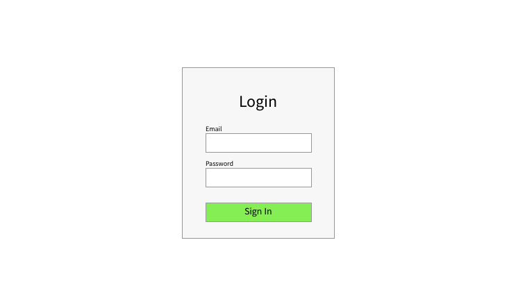
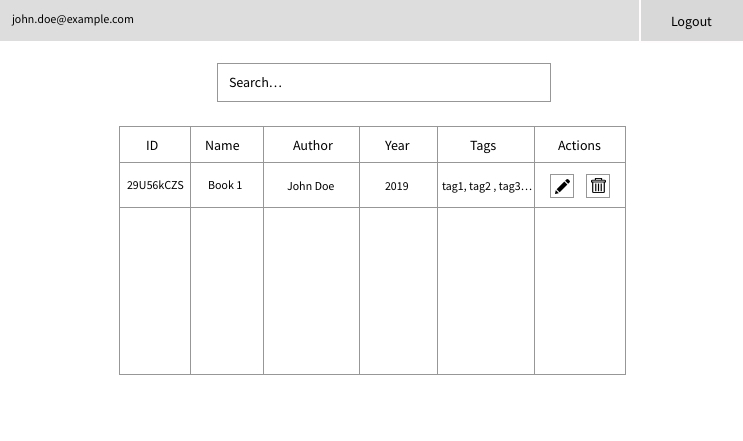
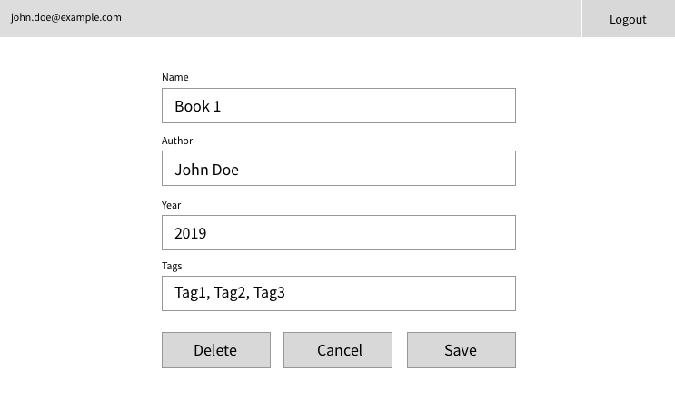
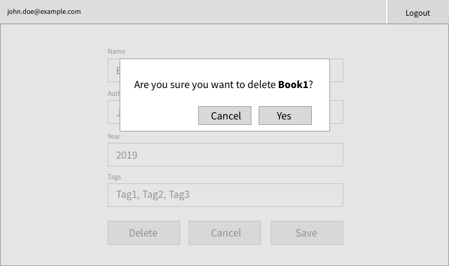

# Devsy react coding challenge

This short coding challenge should represent your coding style, thought process and problem solving. There is no time limit on the challenge.

The challenge consists of building a basic `CRUD` react application for books.
The backend for this application is provided and needs to be run locally.

## Environment setup
You will need to have `NodeJS` setup on your pc. Follow the instructions on https://nodejs.org/en/ for installation.
When you are done just type `node -v` in your command line to see if `NodeJS` was installed. It is preferred to use the `LTS`
version.

You can use whatever you want as package manager. Preferred are `npm` that comes with `NodeJS` or `yarn` that you can install from https://yarnpkg.com/en/.

## Starting the backend server

Navigate into the `api` folder. Install the server dependencies with the command `npm install` or `yarn` depending on your package manager.

Start the server with the command `npm start` or `yarn start`.

If you want to change the `HTTP port` for the server, you can edit the `.env` file and set the port there. The default port is `4000`.

Once you enter the start command, you should see this message:

```
✓ App is running at http://localhost:4000 in development mode
```

Thats all from the server side.

## Starting the frontend client

Navigate into the `client` folder. Install the server dependencies with the command `npm install` or `yarn` depending on your package manager.

Start the server with the command `npm start` or `yarn start`.

Once you enter the start command, you should see this message:

```
Compiled successfully!

You can now view client in the browser.

  Local:            http://localhost:3000/
  On Your Network:  http://192.168.1.10:3000/

Note that the development build is not optimized.
To create a production build, use yarn build.
```

You can now open the browser on `http://localhost:3000/` and see the basic welcome screen.


## Tasks

The client application should consist of few key aspects.

### Authentication

Basic email and password login and one click logout.
The email and password should be hardcoded somewhere in the frontend client. Use `local storage` for a place to store login status between page reloads.

### Navigation

App routing and navigation. There should be 3 screens:

1. Login screen
2. Main screen 
3. Edit screen

You can access `1` only if you are not logged in and you can acces `2` and  `3` only if you are logged in.

You can use any routing library of your choice. The default one recommended by react is https://reacttraining.com/react-router/web.

### State management

Use adequate state management library.
The preferred one is `redux`, but you can use `mobx`, `flux`, `RxJs` or something of your choice.

### CRUD operations

Fetching and manipulating data from the backend server. The server exposes REST API and consumes and produces JSON data.

### Design

This is completely left up to you. The app should have some basic stylings and look decently. You can use plain bootstrap, css, scss, less, css-in-js, css modules. You can even use finished designs like material design components, or flat design and so on... The choice is up to you.

Note on design: I will not grade color choices, ux or ui choices or how pretty or not are the screens. That is not the point of this challenge 🙂.


## API ENDPOINTS

```
GET /api/books -> Get all books
POST /api/books -> Save a book
PUT /api/books/:id -> Update a book
DELETE /api/books/:id -> Delete a book

GET /api/tags -> Get all book tags
```
Regarding the `POST` and `PUT` book methods. You need to provide a book as request body. The request body should look something like this:
```
{
	"name": "Book 1",
	"author": "John Doe",
	"year": 2019,
	"tags": ["tag1", "tag2", "tag3"]
}
```
Note that tags is optional, while the first 3 parameters are mandatory.

The tags endpoint returns a map of tags as keys and arrays of book ids as values. You can use this later in book search by tags.

## Screens

All of the screens bellow are just plain mocks and should only serve the purpose of visually explaining the user flow and data.
The final screens designs are up to you.

Login Screen


Validation for email and password is needed.
Password should be atlest 6 characters with minimum one uppercase, one number and one special character. Once you have valid inputs and write the correct email/password that you have hardcoded in you app, you are then shown the next screen.

Main Screen


In the navbar show the email in the top left, and the logout button in the top right.

The table shows all the books and their respective data fields. The last collumn is the actions buttons holder. One is for edit and when clicked takes you to the next `Edit` screen. The delete button shows a popup or modal that asks if you are sure to delete the book.

The search input filters the table. You can search by `book name`, `author`, `year`, `tags`.

There should be a `Add book` button that should be somewhere on the screen. This button should open the same screen as `Edit screen` with all blank fields in the form.

Edit Screen


A simple form of text inputs and a multiple select input for the `tags`. Use any component for the last input. Validate the fields so they are not empty (except `tags`, they are optional). On save validate and save the book on the server.
On cancel go back. On Delete show this modal and depending on the action go back or delete the book.




## Git workflow

Open a new branch and do all your coding there.
When you are done just make a pull request from your branch to master branch and assign me as a watcher/assignee.

That is all 🙂. 
If there are any issues or questions feel free to reach out and ask me anything trough email/github/devsy. 
